# EcoCoin Project
Version: 1.0

---

## Project Overview
EcoCoin is a platform that enables trading carbon tokens, with each token representing 1 ton of CO₂. This initiative aims to reduce carbon emissions by allowing companies to trade carbon credits, promoting sustainable practices. Customers can purchase tokens using ETH or EUR, depending on their wallet configuration.
## Logo:

---

## Core Idea
- Each EcoCoin represents 1 ton of CO₂.
- Companies can sell or buy EcoCoins based on market conditions.
- Tokens can be purchased with cryptocurrency (ETH) or fiat currency (EUR).

---
## Team Members
- Frontend: Niama Aqarial
- Backend: Salma Doumi
- DevOps: Assia Haimeur
- Blockchain: Karima Ahdich
- Data Analyst: Chaimae Ababri

---

## Technologies Used
- Frontend: Angular, Angular Material
- Backend:
- Blockchain: Ethereum-based smart contracts
- DevOps: Docker,Kubernetes,docker hub ,AKS,Kind, CI/CD pipelines(github actions)
- Data Analysis: 

---

### Setup Instructions
1. Requirements:
   - Node.js (v16 or later)
   - Angular CLI
   - Docker (for deployment)

2. Steps to Run the Project:
   - Clone the repository:
     git clone https://github.com/Assia655/project.git
     cd project
   - Follow the setup instructions in the respective folders (frontend, backend, etc.).

---

# Frontend Contribution by Niama Aqarial
## Features:
  - **Home Page**: Introduces the EcoCoin platform, the sponsors, About information and contact details.
    - Home :
    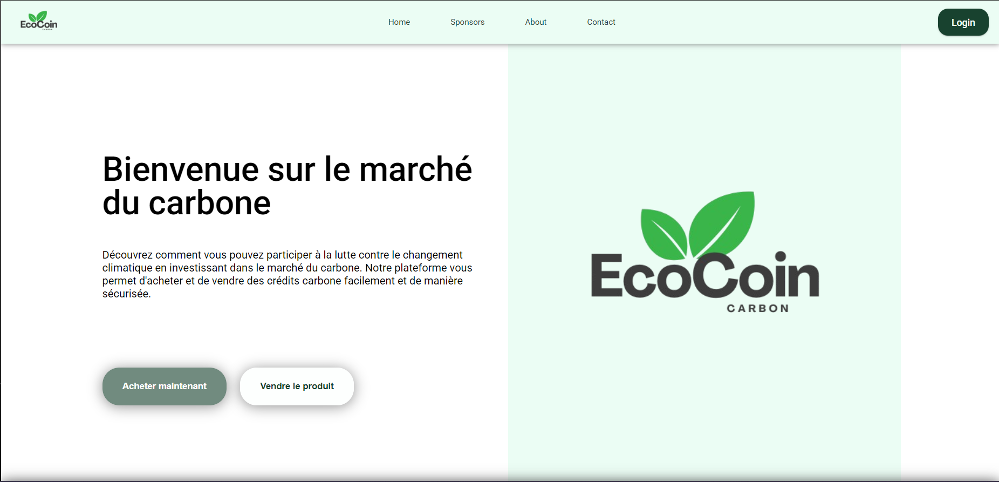
    - Sponsors :
    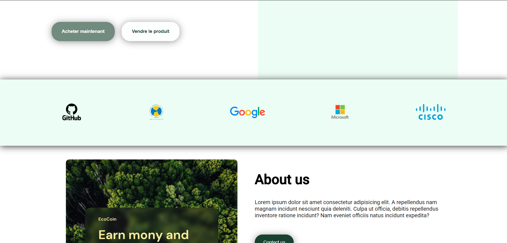
    - About us :
    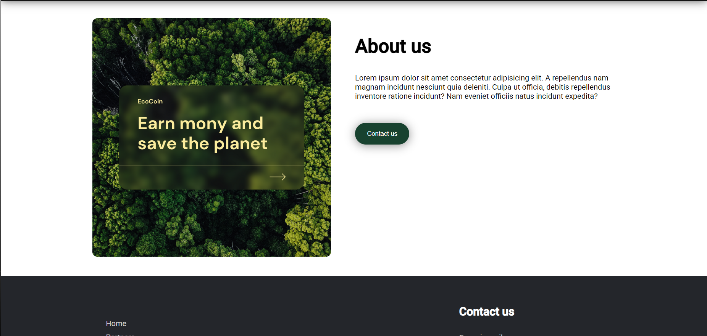
    - Contact :
    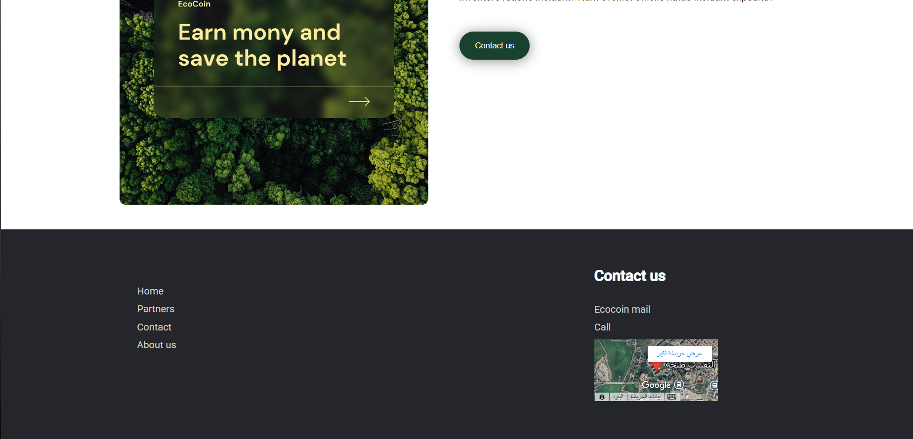
  - **Login**: Contains a Form for the users to login.
    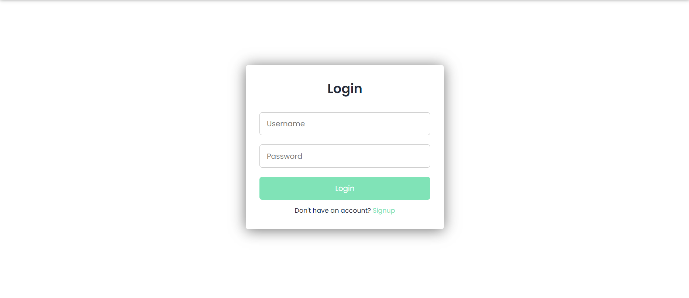
  - **signup**: Created for new users to signup
    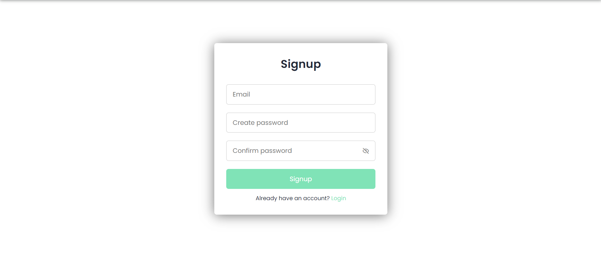
  - **dashboard**: Provides a form for inquiries or feedback.
    - Part 1 :
    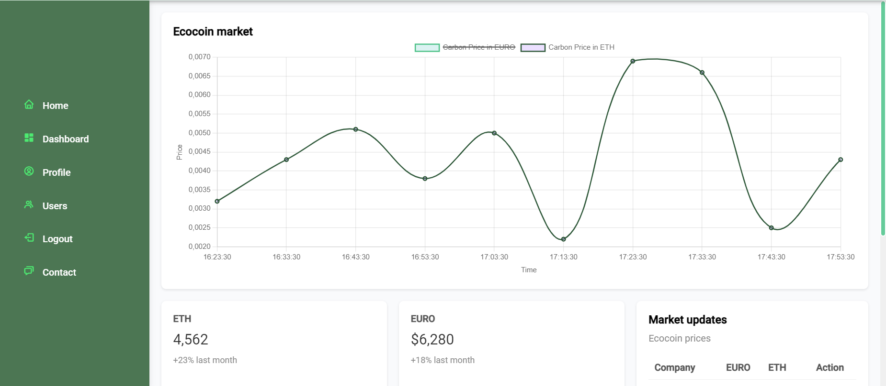
    - Part 2 :
    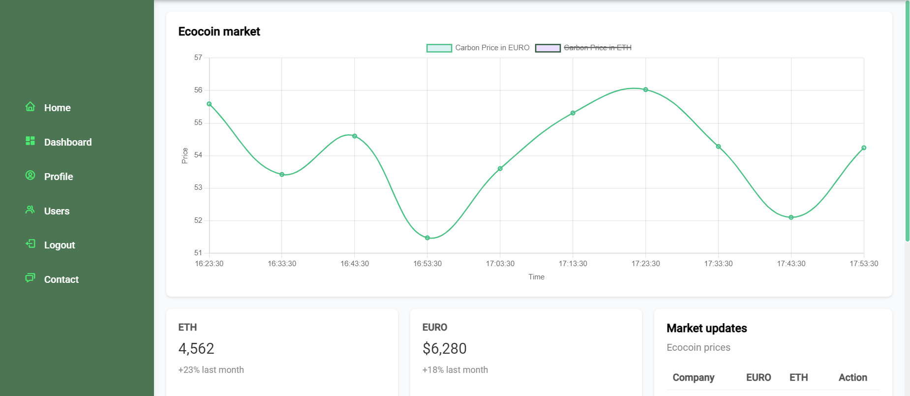
    - Part 3 :
    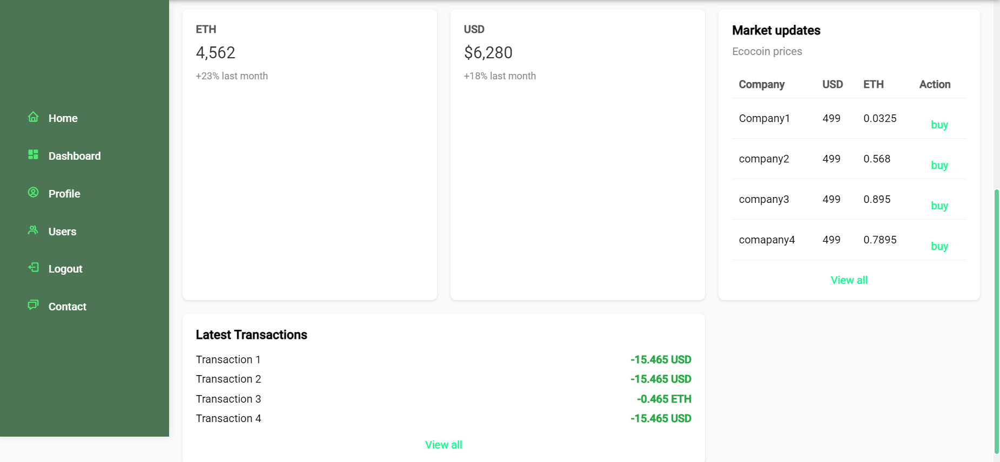
  - **user profile**: Dedicated to display the user profile information.
    - Wallets :
    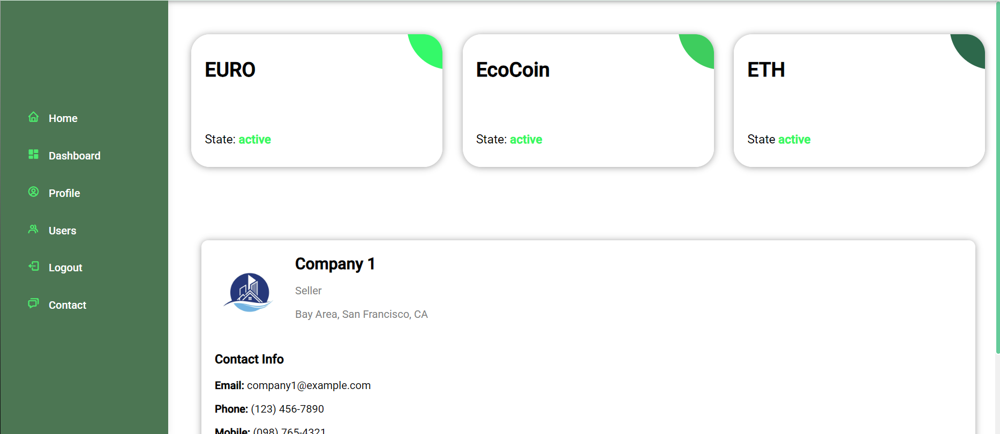
    - Profile :
    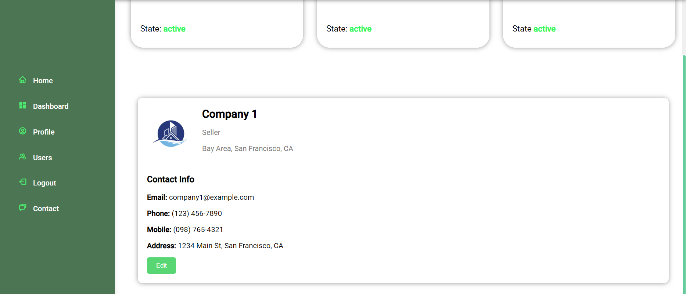
  - **users_list**: this page is for the admin to help manage the users. It includes showing or editing there profile and also deleting them from the database.
    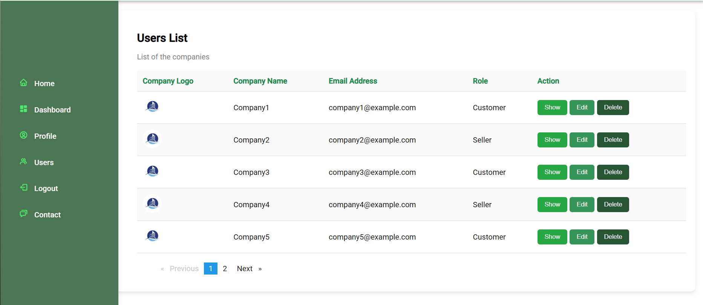
  - **Edit user** : For editing the user profile information
    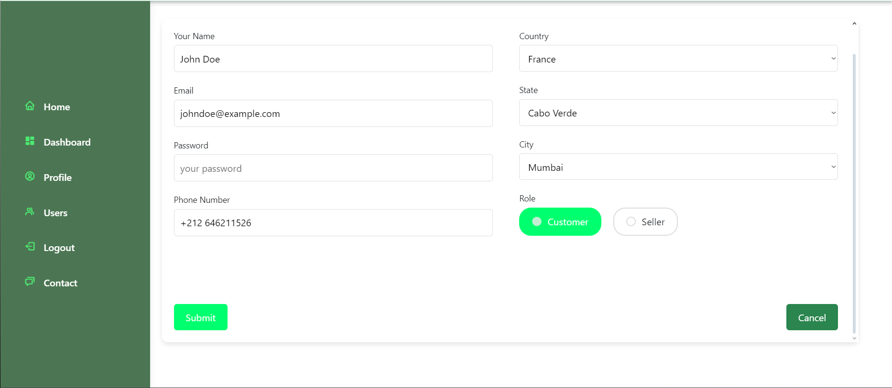
## Technologies :
  - Angular for building the interface.
  - Angular Material combined with CSS and HTML for styling and components.
## Frontend Setup Instructions:
  1. Navigate to the `frontend` directory:
     ```
     cd frontend
     ```
  2. Install dependencies:
     ```
     npm install
     ```
  3. Start the development server:
     ```
     ng serve
     ```
  4. Open your browser at:
     ```
     http://localhost:4200
     ```
## Angular Routes:
- /home
- /user
- /login
- /signup
- /users_list
- /dashboard

# Backend Contribution by Salma Doumi
## FastAPI Overview


FastAPI is a web framework designed for developing APIs with Python. It enables developers to create applications quickly and securely, offering features such as data validation, dependency injection, and support for asynchronous request handling.

---

## What is REST?


REST (Representational State Transfer) is an architectural style used for building web services. It provides a set of constraints that a web service should adhere to in order to be considered "RESTful." The key principles of REST include:

- **Identification of resources through URIs**: Each resource is uniquely identified by a Uniform Resource Identifier (URI).
- **Uniform interface for interacting with resources**: A consistent and standardized approach is used to interact with resources, typically through HTTP methods like GET, POST, PUT, and DELETE.
- **Self-descriptive messages**: Each message contains enough information to describe how to process the message, enhancing clarity and understanding.
- **Hypermedia as the engine of application state**: Clients interact with resources entirely through hypermedia provided dynamically by application servers.

These principles ensure that web services are scalable, stateless, and can be easily understood and interacted with by clients.

---

## HTTP Status Code Flowchart

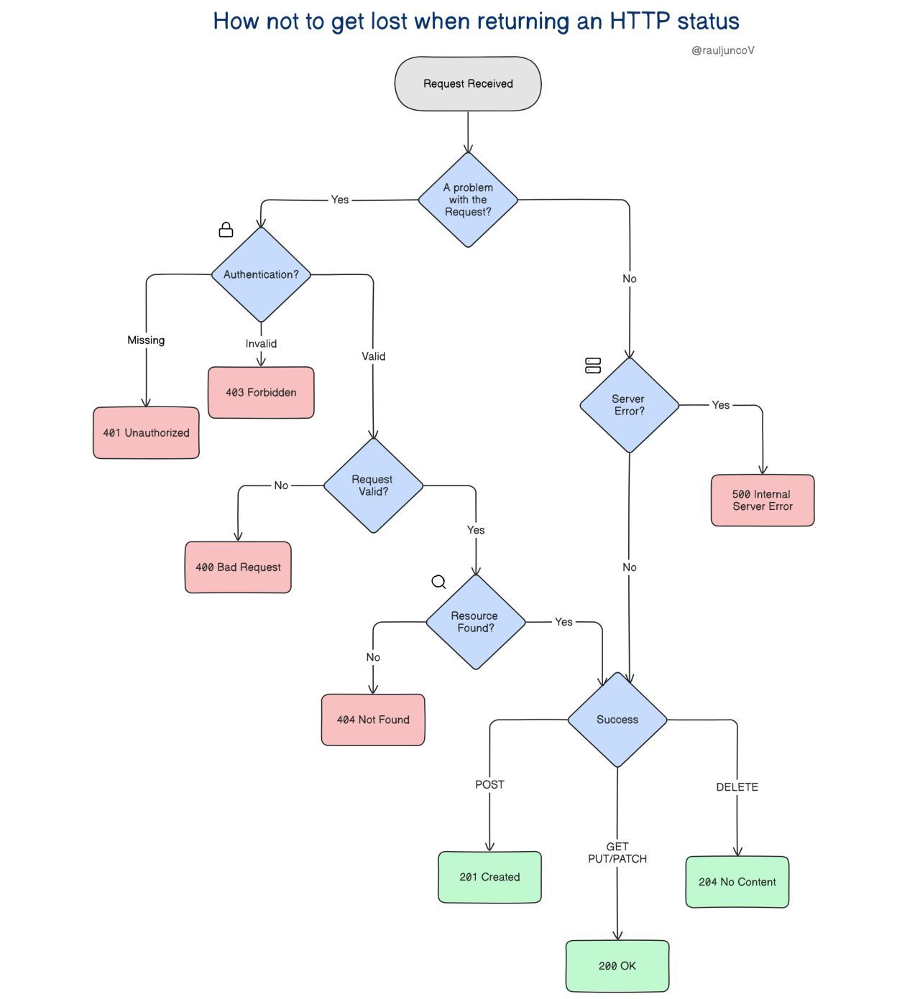

This flowchart provides guidance on selecting the correct HTTP status code when responding to a request. It evaluates the request for issues such as authentication errors (401 Unauthorized, 403 Forbidden), invalid requests (400 Bad Request), missing resources (404 Not Found), or server errors (500 Internal Server Error). For successful operations, it suggests using 201 Created for resource creation, 204 No Content for deletions, and 200 OK for other operations.

---

## Platform Overview

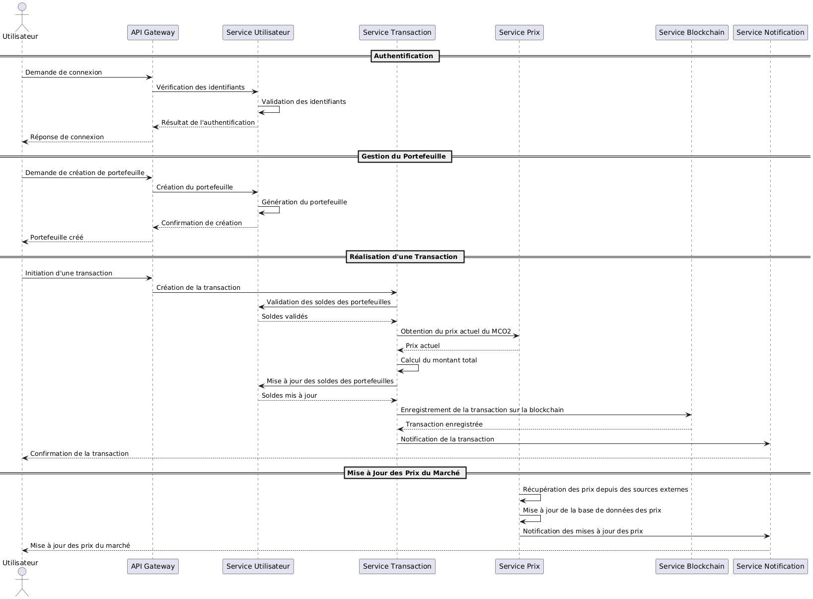

The platform allows users to:

- Manage wallets
- Perform transactions
- Track market prices
- Interact with blockchain-based services
- Purchase carbon credits to offset CO₂ emissions

Each carbon credit corresponds to one ton of CO₂ offset and is represented as a digital token on the Ethereum blockchain.

---

## Microservices Overview

### 1. API Gateway

- **Purpose**: Acts as the entry point for all client requests, routing them to appropriate microservices.
- **Technologies**: FastAPI
- **Responsibilities**:
  - Request routing
  - Authentication and authorization (via JWT/OAuth2)
  - Centralized error handling

### 2. User Service

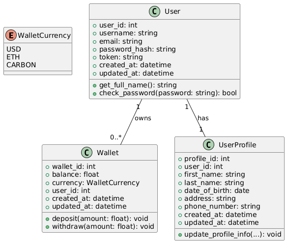

- **Purpose**: Manages user accounts and wallets.
- **Database**: PostgreSQL (`user_service_db`)
- **Features**:
  - **Authentication**:
    - Secure sessions using JWT tokens
    - Passwords hashed with bcrypt
  - **User Management**:
    - Create and manage users
    - Role management (seller, buyer)
  - **Wallet Management**:
    - Create, update, and retrieve wallets

### 3. Transaction Service

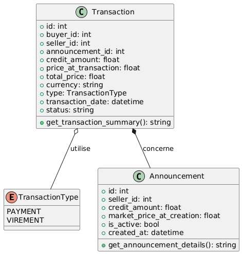

- **Purpose**: Handles transactions, including payments, transfers, and credit purchases.
- **Database**: PostgreSQL (`transaction_service_db`)
- **Features**:
  - Payment and transfer transaction workflows
  - Integration with Price and User Services

### 4. Price Service

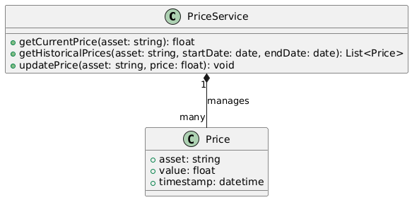

- **Purpose**: Tracks market prices for MCO2 tokens and related currencies.
- **Database**: PostgreSQL (`price_service_db`)
- **Features**:
  - Fetch and store market prices via scraping or APIs

### 5. Blockchain Service

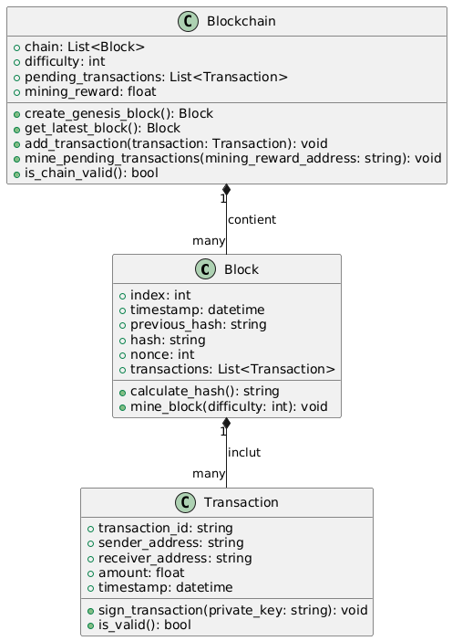

- **Purpose**: Manages blockchain-based transactions and token-related activities.
- **Features**:
  - Integration with Ethereum blockchain via Web3.py
  - Interaction with smart contracts (CarbonAccount, CarbonPayment, CarbonStaking, CarbonToken)

### 6. Notification Service

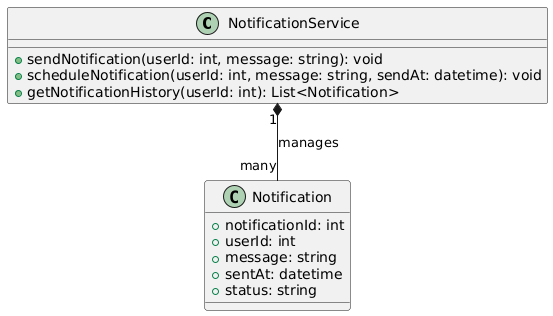

- **Purpose**: Sends transaction updates and blockchain event notifications.
- **Technologies**: Kafka for event-driven architecture

---

## Deployment

### Prerequisites

- Docker and Docker Compose
- PostgreSQL
- Python (with `venv` for virtual environments)

### Steps

1. **Setup Databases**:
   - Create databases: `user_service_db`, `transaction_service_db`, `price_service_db`
   - Apply migrations with Alembic: `alembic upgrade head`
2. **Build and Run Microservices**:
   - Use Docker Compose: `docker-compose up --build`
3. **Start Kafka and Zookeeper**:
   - Zookeeper: `zookeeper-server-start.sh config/zookeeper.properties`
   - Kafka: `kafka-server-start.sh config/server.properties`
4. **Verify Services**:
   - Test endpoints using Postman.

---

## Future Enhancements

- Real-time price updates via WebSocket.
- Expanded currency support.
- Enhanced user notifications.

---

## Additional Resources

### Libraries Used

- FastAPI: Framework to build REST APIs
- SQLAlchemy: ORM for PostgreSQL
- bcrypt: Secure password hashing
- jose: JWT token handling
- Alembic: Database migration management


---

## Messages

### Synchronous (REST API)
- Validate users: `GET /users/{user_id}`
- Update wallets: `PUT /users/{user_id}/wallets`

### Asynchronous (Kafka)
- Wallet updates post-transaction.
- Transaction status notifications.

---
# Blockchain Contribution by Karima Ahdich
## Smart Contract Deployment and Functionality Report

### Solidity - The Language Used

Solidity is a high-level programming language used for writing smart contracts on the Ethereum blockchain. It is similar to JavaScript, but specifically designed to interact with the blockchain. Solidity allows you to create smart contracts, which are autonomous programs stored and executed on the blockchain.

### Main Features of Solidity:

- **Smart Contracts**: Solidity allows you to define smart contracts, which are programs that execute automatically when certain conditions are met. These contracts can manage transactions, digital assets, or interact with other contracts on the blockchain.

- **Data Types**:
    - uint, int: Unsigned and signed integers.
    - address: Types of addresses for Ethereum accounts.
    - bool: Boolean values.
    - string: Strings of characters.
    - mapping: Mappings (dictionaries) that link keys to values, for example, to track the balance of users.

- **Modifiers**: Solidity allows the use of modifiers, which are reusable functions that manage access permissions. For example, the `onlyOwner` modifier restricts access to certain functions to the contract’s administrator.

- **Events**: Events are used to notify external applications about state changes in contracts. For example, an event might be triggered when a user is registered, or when carbon credits are added.

## Contract `CarbonAccount.sol`

### Features:

- **User Registration**: The contract allows registering users by associating an Ethereum address with wallet information. The wallet address is initially set to 0x0 during registration.
- **Wallet Association**: After registering a user, a wallet address can be associated with the user through the `linkWallet()` function.
- **Carbon Credit Credit**: The `creditCarbon()` function allows the owner to add carbon credits for a specific user.
- **Ownership Management**: Only the owner of the contract (the address that deployed the contract) can call sensitive functions such as `registerUser`, `linkWallet`, and `creditCarbon`.

## Contract `CarbonToken.sol`
### Features:

- **ERC-20 Token**: This contract creates an ERC-20 token called `CarbonToken` with the symbol `CTK`.
- **Carbon Credit Creation**: The owner of the contract can call the `mint(address to, uint256 amount)` function to create tokens for a user.
- **Carbon Credit Transfer**: The `transferCarbon(address to, uint256 amount)` function allows transferring carbon credits between users.
- **Carbon Credit Burning**: The `burn(address from, uint256 amount)` function allows burning carbon credits, removing them from the system.
- **Carbon Credit Verification**: The `balanceOfCarbon(address user)` function allows checking the carbon credits held by a user.
## Contract `CarbonStaking.sol`

### Features:

- **Carbon Credit Staking**: This contract allows users to stake their carbon credits to participate in ecological projects such as tree planting.
- **Unstaking Carbon Credits**: The `unstake()` function allows users to withdraw their staked credits after a defined staking period.
- **Staked Credit Verification**: The `getStakedBalance(address user)` function allows checking the amount of carbon credits staked by a user.

## Contract `CarbonPayement.sol`

### Features:

- **Payment Management**: This contract allows users to make payments using traditional methods, such as credit cards or bank transfers, to purchase carbon credits.
- **Conversion of Funds into Tokens**: The `convertToCarbonTokens()` function allows converting funds (such as Ethereum) into carbon credits.
- **Payment Tracking**: The `trackPayment()` function allows tracking the payment history made by users.

## Deployment with MetaMask, Hardhat, and Sepolia

The 4 smart contracts were initially created in Remix, an online IDE for Solidity development. After writing and compiling the contracts, Remix was connected to MetaMask through the Injected Web3 provider. This connection allowed Remix to interact with the Ethereum network using the accounts available in MetaMask. With MetaMask acting as the wallet and providing the necessary network connection, the contracts were deployed on a chosen network, whether local or testnet (Sepolia). This setup enabled seamle...

### Deployment with MetaMask and Hardhat:

### Prerequisites:

- **MetaMask** is used to manage Ethereum accounts and connect to Ethereum networks.
- **Hardhat** is used for deploying and testing the contracts locally or on a testnet.

### Setting up Hardhat:
1. Install Hardhat: `npm install --save-dev hardhat`.
2. Create a deployment script in the `scripts` folder.
3. Deploy to a local network using the command:
    ```bash
    npx hardhat run --network localhost
    ```

### Deployment on Sepolia Testnet:

- Configuring Sepolia Network:
1. Configure Hardhat to connect to Sepolia in the `hardhat.config.js` file.
2. Get test ETH for Sepolia via a faucet. I used [this link](https://cloud.google.com/application/web3/faucet/ethereum/sepolia).
3. Deploy to Sepolia using the command:
    ```bash
    npx hardhat run scripts/deploy.js --network sepolia
    ```

### Connecting with MetaMask:
- **MetaMask** was configured to interact with the deployed contracts on the local network or the Sepolia testnet.
- **MetaMask** was used to manage accounts and interact with the Ethereum blockchain.

### Integration with Web3.py

## Installing Web3.py:

You installed Web3.py with the following command:
```bash
pip install web3
```

## Connecting to MetaMask:
**Web3.py** was used to interact with the contracts through MetaMask by using the `window.ethereum` instance to connect via the browser.

```python
from web3 import Web3

Web3_provider="http://127.0.0.1:8545"

web3=Web3(Web3.HTTPProvider(Web3_provider))

contract_address = 'the contract address after deployment'

abi = [...] # Contract ABI “Abi du contract is in the remix compiler tab” 

if not web3.is_connected():
    print("Web3 not connected")
```

## Interacting with Contracts via Web3.py:

Example of calling a function in the contract with Web3.py:
```python
result = contract.functions.functionName().call()
print(result)
```

## Sending Transactions via Web3.py:
```python
txn = contract.functions.creditCarbon(user_address, 100).buildTransaction({
    'from': user_address,
    'gas': 2000000,
    'gasPrice': web3.toWei('20', 'gwei'),
    'nonce': web3.eth.getTransactionCount(user_address),
})

signed_txn = web3.eth.account.signTransaction(txn, private_key='')
txn_hash = web3.eth.sendRawTransaction(signed_txn.rawTransaction)

print(f'Transaction hash: {txn_hash.hex()}')
```
---
## Blockchain Test
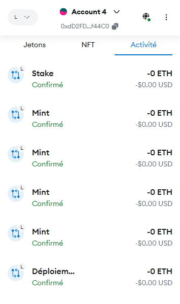

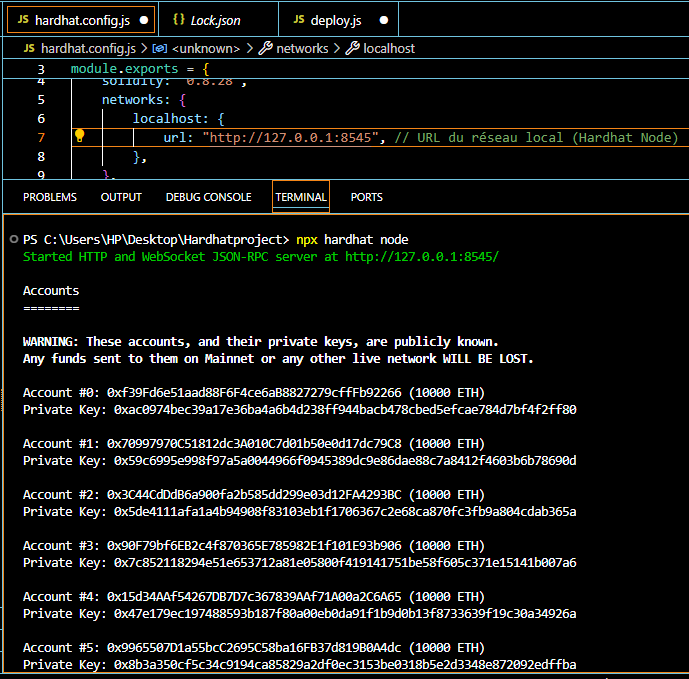

.PNG)
.PNG)
---
# DevOps - Management and Deployment of Microservices Contribution by Assia Haimeur

**About the Project**

In this project, my primary role was as a **DevOps Engineer**. I managed the entire lifecycle of the microservices, from creating Dockerfiles to deploying the microservices on the cloud using **Azure Kubernetes Service (AKS)**. This document outlines the technical steps I followed, the tools used, and the results achieved.

---

**Project Architecture**

The architecture of this project includes multiple interconnected microservices (API Gateway, User Service, Transaction Service, etc.), each exposed on a unique port. Below is a summary illustration of the architecture:


The deployment involves a single Azure Kubernetes Service (AKS) cluster with one node hosting multiple pods. Each pod contains a container for the respective microservice. The services communicate with each other via Kubernetes networking, and the API Gateway uses a LoadBalancer service to expose the application to external traffic.

---

**Work Environment**

- Installed Tools:

1. **Docker Desktop**: For creating and testing containers locally.
2. **kubectl** and **Kind**: For managing Kubernetes clusters locally.
3. **GitHub Actions**: To implement a CI/CD pipeline.
4. **Azure Kubernetes Service (AKS)**: For final deployment on the cloud.
5. **Docker Hub**: Used as a registry to store and share Docker images.

---

## Technical Steps

### Creating Dockerfiles

I created **Dockerfiles** for each microservice. Here is an example of a Dockerfile used for Python-based services:

```dockerfile
FROM python:3.10-slim AS base

# Define the working directory inside the container
WORKDIR /app

# Copy the requirements.txt file containing dependencies
COPY requirements.txt .

# Install the dependencies
RUN pip install --no-cache-dir -r requirements.txt

# Copy the application code into the container
COPY . .

# Expose the port used by the FastAPI application
EXPOSE 8001

# Define the startup command for Uvicorn
CMD ["uvicorn", "app.main:app", "--host", "0.0.0.0", "--port", "8001"]
```

Each microservice was exposed on a unique port to avoid conflicts.

### List of Ports Used

- **User Service**: Port 8004
- **Transaction Service**: Port 8003
- **Price Service**: Port 8002
- **API Gateway**: Port 8005
- **Frontend**: Port 3000
- **Blockchain Service**: Port 8001
- **Notification Service**: Port 8006

### Testing Containers with Docker Compose

I wrote a `docker-compose.yml` file to test the interconnection of microservices locally. Here's a snippet:

```yaml
version: "3.9"
services:
  user_service:
    build:
      context: ./backend/user_service
    ports:
      - "8004:8004"
    environment:
      - DB_HOST=user_db
  user_db:
    image: postgres:13
    ports:
      - "5432:5432"
```

Commands used:

- Build containers: `docker-compose build`
- Run containers: `docker-compose up`

### Creating Kubernetes Files

#### Why Use PVC for Databases

Persistent Volume Claims (PVCs) ensure that the database data persists even if the pods are terminated or restarted. This provides resilience and durability for critical data.

#### Service Types

- **NodePort**: Used for testing services locally and providing direct access to the services.
- **ClusterIP**: Default service type for internal communication between microservices.
- **LoadBalancer**: Used for exposing the API Gateway to external traffic, enabling users to access the application.

#### Example YAML Files

Deployment for User Service:

```yaml
apiVersion: apps/v1
kind: Deployment
metadata:
  name: user-service
spec:
  replicas: 2
  selector:
    matchLabels:
      app: user-service
  template:
    metadata:
      labels:
        app: user-service
    spec:
      containers:
      - name: user-service
        image: dockerhub_username/user-service:latest
        ports:
        - containerPort: 8004
```

Persistent Volume Claim for Database:

```yaml
apiVersion: v1
kind: PersistentVolumeClaim
metadata:
  name: user-db-pvc
spec:
  accessModes:
    - ReadWriteOnce
  resources:
    requests:
      storage: 1Gi
```

Service for API Gateway:

```yaml
apiVersion: v1
kind: Service
metadata:
  name: api-gateway
spec:
  type: LoadBalancer
  selector:
    app: api-gateway
  ports:
    - protocol: TCP
      port: 80
      targetPort: 8005
```

### Deployment with AKS (Azure Kubernetes Service)

#### Steps Followed:

1. Create a Kubernetes cluster on Azure:
   ```bash
   az aks create --resource-group myResourceGroup --name myAKSCluster --node-count 1 --enable-addons monitoring --generate-ssh-keys
   ```
2. Connect to the cluster:
   ```bash
   az aks get-credentials --resource-group myResourceGroup --name myAKSCluster
   ```
3. Deploy the microservices to the Azure cluster:
   ```bash
   kubectl apply -f deployment.yaml
   kubectl apply -f service.yaml
   ```

### CI/CD Pipeline with GitHub Actions

I created a GitHub Actions workflow to automate the process of building and pushing Docker images to Docker Hub, as well as local deployment with Kind.

Example `github-actions.yml` file:

```yaml
name: CI/CD Pipeline
on:
  push:
    branches:
      - main

jobs:
  build-and-push:
    runs-on: ubuntu-latest
    steps:
    - name: Checkout Code
      uses: actions/checkout@v3
    - name: Log in to Docker Hub
      run: echo ${{ secrets.DOCKER_PASSWORD }} | docker login -u ${{ secrets.DOCKER_USERNAME }} --password-stdin
    - name: Build and Push Docker Images
      run: |
        docker build -t dockerhub_username/user-service ./backend/user_service
        docker push dockerhub_username/user-service
  deploy-kind:
    runs-on: ubuntu-latest
    steps:
    - name: Deploy to Kind Cluster
      run: |
        kubectl apply -f deployment.yaml
```

---
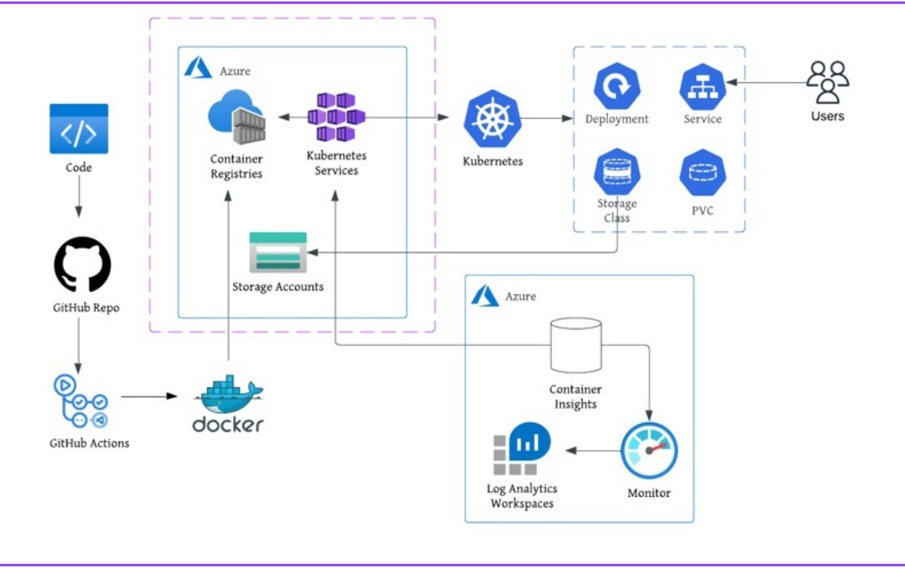
---

## Results Achieved

1. not All tested microservices were successfully containerized and deployed (User Service, Transaction Service, Price Service, and API Gateway) but it still (blockchain service, notification service , front end ) not deployed because my colleges didn't coplete them and they pushed all yesterday so a didn't found time to manage all of this .
2. A functional CI/CD pipeline was established with GitHub Actions for building, pushing, and deployment  .
3. Deployment of microservices to a Kubernetes cluster using both Kind (local) and AKS (cloud).

---

## Future Improvements

1. Migrate to a more scalable cloud solution.
2. Deploy the full application, including Blockchain and Notification Services, on AWS.
3. Implement advanced monitoring with Prometheus and Grafana.
4. Use Helm to simplify Kubernetes deployments.

---

# DataAnaliysis -Chaimae Abarbri
## 1. Data Scraping and Database Insertion

### 1.1 Scraping Objective
The goal of the scraping process is to collect historical data on carbon emissions from the following site:
- **URL**: [https://www.investing.com/commodities/carbon-emissions-historical-data](https://www.investing.com/commodities/carbon-emissions-historical-data)

Key Data to Scrape:
1. Carbon Price Data:
   - Date
   - Price in EURO
   - Percentage Change
2. Retrieve ETH Historical Price:
   - Calculate the ratio between the carbon price in EURO and Ethereum's price in ETH.

   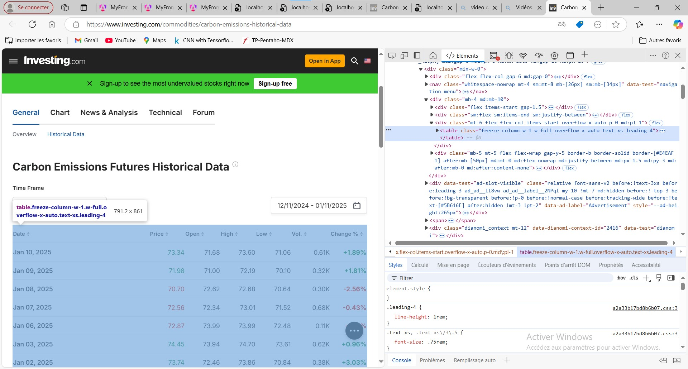

### 1.2 Extracting Data from the Web Page
The scraping process begins with sending an HTTP request to the target URL using the `requests` library. Once the page is retrieved, it is parsed using `BeautifulSoup`, a Python library for extracting data from HTML structures.

#### 1.2.1 Retrieving the HTML Page
- A GET request is sent to the target URL.
- If the request is successful (HTTP status code 200), the HTML page is retrieved for parsing.

#### 1.2.2 Parsing the HTML Content
- The HTML content is parsed using `BeautifulSoup`.
- The table containing carbon emissions data is extracted by selecting rows and ignoring the first header row.

### 1.3 Retrieving ETH Price
- ETH prices are fetched from the CoinGecko API.
- A function `get_eth_price_on_date(date)` sends a request to the CoinGecko API to obtain the historical price of ETH on a specific date.
- The carbon price in ETH is calculated by dividing the carbon price in EURO by the ETH price.

### 1.4 Parallel Processing of Data
To improve performance, the data processing is done in parallel using the `concurrent.futures` library.
- `ThreadPoolExecutor` is used to process each row concurrently, speeding up the scraping process.

### 1.5 Data Validation and Insertion into PostgreSQL Database
- A PostgreSQL database is used to store the scraped data in the `carbon_emissions_data` table with the following columns:
  - `date`: Date of carbon emissions
  - `price`: Price of carbon emissions in EUR
  - `change_percent`: Percentage change in the price
  - `price_eth`: Price of carbon emissions in ETH
  - `timestamp`: Timestamp of the insertion

- Data is inserted into the database after validating that no duplicate entries exist for a given date.

### 1.6 Error Handling and API Rate Limits
- If the CoinGecko API rate limit is exceeded (HTTP status code 429), the ETH price for that date is skipped.
- Errors during scraping or database insertion are logged for troubleshooting.

## 2. Python Script

### 2.1 Database Initialization
The script begins by initializing the PostgreSQL database connection and creating the necessary tables if they do not already exist.

### 2.2 Data Extraction
The data extraction process is carried out in the following steps:
1. Retrieve and parse the HTML page.
2. Extract relevant carbon price data.
3. Fetch the ETH price for each date.
4. Calculate the carbon price in ETH.
5. Insert the data into the PostgreSQL database.

### 2.3 Results
- The data is successfully scraped and inserted into PostgreSQL.
- The ratio of carbon price to ETH is calculated for each date.
- Performance improvements are achieved through multi-threading and caching API calls.

## 3. Data Analysis

### 3.1 Objectives
- **Analyze transaction volumes**: Calculate the total transaction volumes on the platform.
- **Analyze cryptocurrency movements**: Study the evolution of exchanged tokens.
- **Provide interactive financial reports**: Use visualization tools for real-time insights.

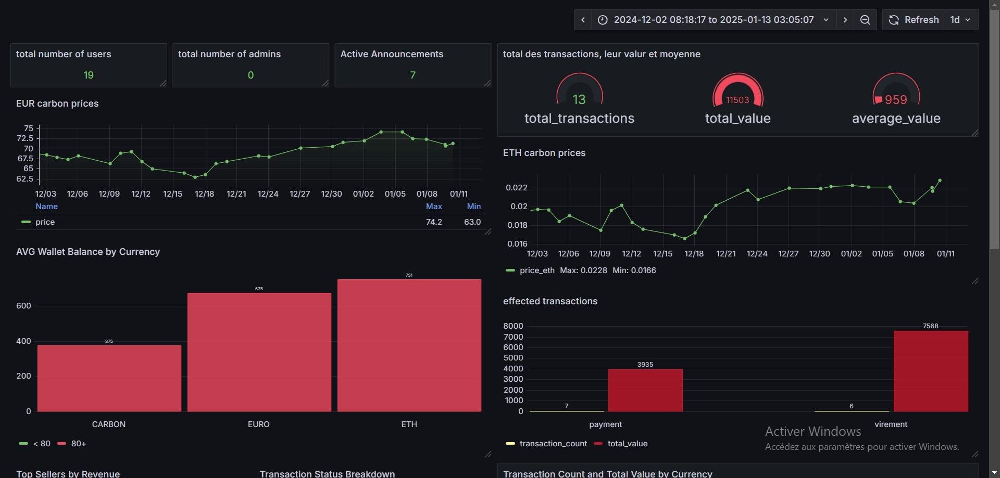

### 3.2 Results
- **Total Transaction Volumes**: Most transactions have a total value under 1200 EUR.
- **Carbon/ETH Price Ratio**: The correlation between the prices of carbon and ETH shows that the ratio fluctuates similarly over time.


## 4. Grafana Visualization

### 4.1 Usage of Grafana
Grafana is used to create interactive dashboards for visualizing data stored in PostgreSQL. Key metrics and charts include:
- **Total Number of Users**: 19 users
- **Total Number of Admins**: 0 admins
- **Active Announcements**: 7 announcements
- **Transaction Summary**: 13 transactions processed, totaling 11503 EUR.

### 4.2 Carbon Prices Analysis
- **EUR Carbon Prices**: Fluctuations between 63.0 and 74.2 EUR.
- **ETH Carbon Prices**: Prices range from 0.0166 to 0.0228 ETH.


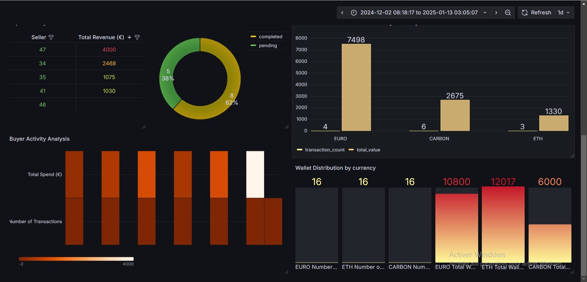


## 5. Integration with Backend and Frontend

### 5.1 Backend Integration
- The backend service provides endpoints for:
  - Fetching the latest market prices
  - User authentication and wallet balance management
  - Handling transactions

### 5.2 Frontend Integration
- The frontend is linked to the backend via an API service in Angular, allowing users to view their wallet balances, carbon prices, and transaction details on the dashboard.

### 5.3 Services Linked
- **Price Service**: Displays the latest carbon price in EUR or ETH.
- **Transaction Service**: Displays user transactions and balances.

## 6. Conclusion

- **Revenue Leaders**: Seller 46 leads in revenue generation.
- **Transaction Status**: 38% of transactions are still pending, indicating room for improvement.
- **Currency Trends**: EURO is the dominant currency for transaction value, while CARBON has the highest transaction count.
- **Buyer Patterns**: Some buyers are high-value users with frequent transactions.

## 7. Limitations
- **Market Closures**: The Investing.com website may close the carbon market, causing data retrieval issues. If today's data is unavailable, the last known price is used.


Contact
For any questions or feedback, feel free to contact the team:
- Niama Aqarial (Frontend Developer): niama.aqarial@gmail.com
- Salma Doumi (Backend Developer) :
- Assia Haimeur (DevOps Engineer) : haimeurassia70@gmail.com
- Karima Ahdich (Blockchain Developer) : karimaahdich@gmail.com
- Chaimae Ababri (Data Analyst) : chaimaeababri14@gmail.com

