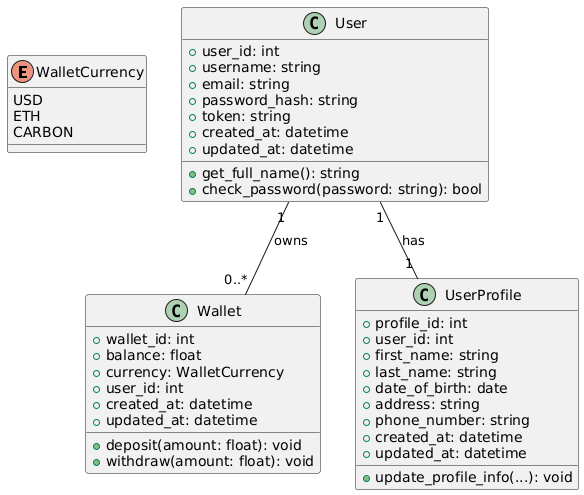

# EcoCoin Platform Documentation

## Overview

The EcoCoin Platform is a microservice-based architecture designed to facilitate transactions using Carbon MCO2 tokens. It enables users to manage wallets, perform transactions, track market prices, and interact with blockchain-based services. This platform also allows users to purchase carbon credits to offset their CO₂ emissions.

---

## FastAPI Overview

FastAPI is a web framework designed for developing APIs with Python. It enables developers to create applications quickly and securely, offering features such as data validation, dependency injection, and support for asynchronous request handling.

---

## What is REST?

REST (Representational State Transfer) is an architectural style used for building web services. It provides a set of constraints that a web service should adhere to in order to be considered "RESTful." The key principles of REST include:

- **Identification of resources through URIs**: Each resource is uniquely identified by a Uniform Resource Identifier (URI).
- **Uniform interface for interacting with resources**: A consistent and standardized approach is used to interact with resources, typically through HTTP methods like GET, POST, PUT, and DELETE.
- **Self-descriptive messages**: Each message contains enough information to describe how to process the message, enhancing clarity and understanding.
- **Hypermedia as the engine of application state**: Clients interact with resources entirely through hypermedia provided dynamically by application servers.

These principles ensure that web services are scalable, stateless, and can be easily understood and interacted with by clients.

---

## HTTP Status Code Flowchart

This flowchart provides guidance on selecting the correct HTTP status code when responding to a request. It evaluates the request for issues such as authentication errors (401 Unauthorized, 403 Forbidden), invalid requests (400 Bad Request), missing resources (404 Not Found), or server errors (500 Internal Server Error). For successful operations, it suggests using 201 Created for resource creation, 204 No Content for deletions, and 200 OK for other operations.

---

## Platform Overview

The platform allows users to:

- Manage wallets
- Perform transactions
- Track market prices
- Interact with blockchain-based services
- Purchase carbon credits to offset CO₂ emissions

Each carbon credit corresponds to one ton of CO₂ offset and is represented as a digital token on the Ethereum blockchain.

---

## Microservices Overview

### 1. API Gateway

- **Purpose**: Acts as the entry point for all client requests, routing them to appropriate microservices.
- **Technologies**: FastAPI
- **Responsibilities**:
  - Request routing
  - Authentication and authorization (via JWT/OAuth2)
  - Centralized error handling

### 2. User Service

- **Purpose**: Manages user accounts and wallets.
- **Database**: PostgreSQL (`user_service_db`)
- **Features**:
  - **Authentication**:
    - Secure sessions using JWT tokens
    - Passwords hashed with bcrypt
  - **User Management**:
    - Create and manage users
    - Role management (seller, buyer)
  - **Wallet Management**:
    - Create, update, and retrieve wallets

### 3. Transaction Service

- **Purpose**: Handles transactions, including payments, transfers, and credit purchases.
- **Database**: PostgreSQL (`transaction_service_db`)
- **Features**:
  - Payment and transfer transaction workflows
  - Integration with Price and User Services

### 4. Price Service

- **Purpose**: Tracks market prices for MCO2 tokens and related currencies.
- **Database**: PostgreSQL (`price_service_db`)
- **Features**:
  - Fetch and store market prices via scraping or APIs

### 5. Blockchain Service

- **Purpose**: Manages blockchain-based transactions and token-related activities.
- **Features**:
  - Integration with Ethereum blockchain via Web3.py
  - Interaction with smart contracts (CarbonAccount, CarbonPayment, CarbonStaking, CarbonToken)

### 6. Notification Service

- **Purpose**: Sends transaction updates and blockchain event notifications.
- **Technologies**: Kafka for event-driven architecture

---

## Deployment

### Prerequisites

- Docker and Docker Compose
- PostgreSQL
- Python (with `venv` for virtual environments)

### Steps

1. **Setup Databases**:
   - Create databases: `user_service_db`, `transaction_service_db`, `price_service_db`
   - Apply migrations with Alembic: `alembic upgrade head`
2. **Build and Run Microservices**:
   - Use Docker Compose: `docker-compose up --build`
3. **Start Kafka and Zookeeper**:
   - Zookeeper: `zookeeper-server-start.sh config/zookeeper.properties`
   - Kafka: `kafka-server-start.sh config/server.properties`
4. **Verify Services**:
   - Test endpoints using Postman.

---

## Future Enhancements

- Real-time price updates via WebSocket.
- Expanded currency support.
- Enhanced user notifications.

---

## Additional Resources

### Libraries Used

- FastAPI: Framework to build REST APIs
- SQLAlchemy: ORM for PostgreSQL
- bcrypt: Secure password hashing
- jose: JWT token handling
- Alembic: Database migration management

---

## Messages

### Synchronous (REST API)
- Validate users: `GET /users/{user_id}`
- Update wallets: `PUT /users/{user_id}/wallets`

### Asynchronous (Kafka)
- Wallet updates post-transaction.
- Transaction status notifications.
